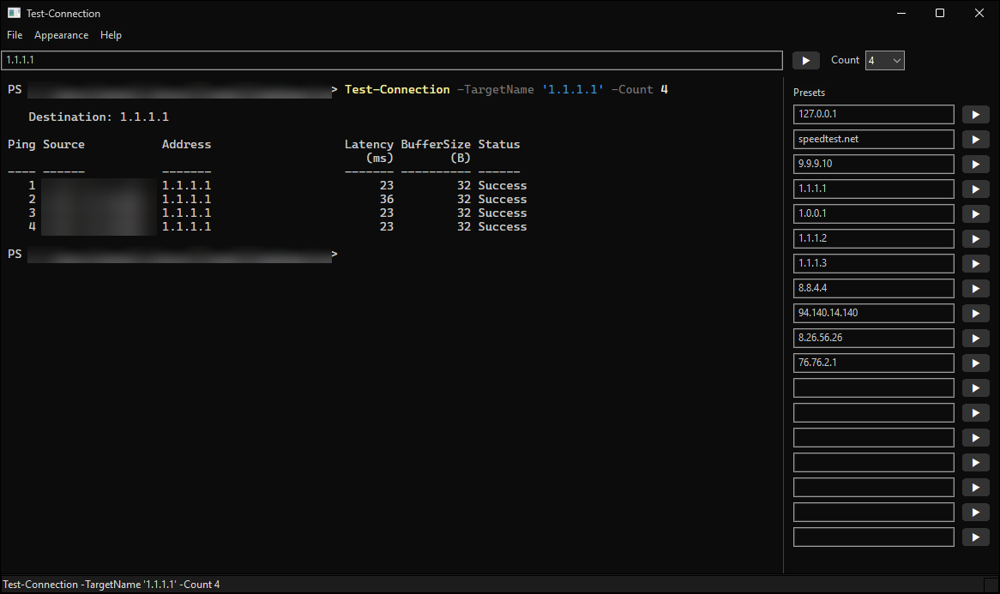

# pingorganizer



A C++ wxWidgets window with a target textbox, a ▶ run button and a Count
dropdown (1–10, 15, 20, 50 or 100), above a **real** embedded PowerShell 7 terminal, with a column of
editable preset targets down the right-hand side, loaded from a text file you
control. Pressing any ▶ types

```
Test-Connection -TargetName '<target>' -Count <n>
```

into that shell, exactly as if you had typed it yourself.

The terminal is not a log pane. It is a full interactive `pwsh.exe` with
PSReadLine, tab completion, syntax colouring, history, `Ctrl+C`, and resize —
the same behaviour you get inside Windows Terminal.

**Tested on Windows 11.**

## Download

Grab `pingorganizer-v0.2-win-x64.zip` from the
[latest release](https://github.com/aigles1/pingorganizer/releases/latest),
unzip it anywhere, and run `PingOrganizer.exe`. Keep the `assets` folder next to
the exe — the terminal is loaded from it.

Nothing else to install on Windows 11 beyond PowerShell 7: the C++ runtime is
linked into the exe, and the WebView2 Runtime ships with Windows 11.

## How it works

Three pieces:

| Piece | Job |
|---|---|
| **ConPTY** (`src/ConPty.cpp`) | Creates a Windows pseudo console with `CreatePseudoConsole`, spawns `pwsh.exe` attached to it, and pumps the two VT byte pipes. PowerShell cannot tell this apart from Windows Terminal. |
| **xterm.js** (`assets/`) | Parses the VT stream and renders it — glyphs, 24-bit colour, selection, scrollback. It is the same emulator VS Code uses. |
| **WebView2** (`src/TerminalPanel.cpp`) | Hosts xterm.js as a child HWND filling a `wxPanel`, and carries bytes both ways over `postMessage`. |

wxWidgets has no terminal control, and writing a VT emulator by hand is weeks of
work, so the renderer is borrowed rather than rebuilt.

```
 wxTextCtrl / wxButton / wxChoice        (plain wxWidgets)
 ─────────────────────────────────────
 TerminalPanel (wxPanel)
   └── WebView2 HWND
         └── xterm.js  ──postMessage──┐
                                      │
                              ConPty  │  base64'd VT bytes
                                │     │
                                └── pwsh.exe on a pseudo console
```

### Message protocol

Plain strings across the WebView2 bridge:

| Direction | Message | Meaning |
|---|---|---|
| page → host | `ready:<cols>,<rows>` | terminal laid out; start the shell |
| page → host | `i:<base64>` | keystrokes / paste |
| page → host | `s:<cols>,<rows>` | resized → `ResizePseudoConsole` |
| host → page | `o:<base64>` | raw pty output |
| host → page | `focus` | focus the terminal |
| host → page | `x:<text>` | host status line, drawn dim |

## Building

Needs Visual Studio 2026 (or 2022) with the C++ workload, CMake ≥ 3.24, and an
internet connection for the first configure.

```bash
pwsh -File build.ps1 -Run
```

The first run downloads wxWidgets 3.3.2, the WebView2 SDK and xterm.js, then
builds wxWidgets statically — five to ten minutes. After that, rebuilds take
seconds. `-Clean` starts over; `-Config Debug` builds a debug binary.

Output lands in `build/Release/PingOrganizer.exe` with an `assets/` folder beside
it. Both are needed. The WebView2 loader and the MSVC runtime are both linked
statically, so there is no extra DLL to copy and no Visual C++ Redistributable
to install.

### Runtime requirements

- Tested on Windows 11. Should work on Windows 10 1809 or newer (ConPTY), but
  that has not been tested.
- The Evergreen WebView2 Runtime — preinstalled on Windows 11
- PowerShell 7 (`pwsh.exe`); found via `PATH`, then the usual install locations

## Notes

**Presets.** The right-hand column is read from a plain text file:

```
%APPDATA%\PingOrganizer\presets.txt
```

One target per line; blank lines and `#` comments ignored. A line containing
`=` is a setting rather than a target — no hostname or IP address, v4 or v6, can
contain one — and the only setting today is `appearance = light` or
`appearance = dark` (see Dark mode below). The file is created
with a default list on first run, so there is something to edit rather than a
blank page, and the app falls back to that built-in list (`kDefaultPresets` in
`src/main.cpp`) if the file is missing, unreadable or empty. Hovering the
**Presets** heading shows the full path.

**Edits in the preset boxes are saved to the file.** An edit is written when
you leave the box, when you run that preset with ▶ or Enter, and when the app
closes — so one still being typed when you quit is not lost. Only the target
lines are rewritten, and the file is re-read from disk first: comments, blank
lines and the `appearance` setting stay exactly where they were, and the list
from the boxes fills the existing target lines in order, so hand-made grouping
survives. A cleared box drops its line; text typed into a spare row is added
after the last target. A value containing `=` or starting with `#` is not
written, because it would read back as a setting or a comment — typing
`appearance = dark` into a box must not change the appearance — and the status
bar says so. Clearing every box leaves no targets, which on the next start
brings back the built-in defaults.

Changes made to the file *directly*, in an editor, still need a restart to
show. And the two can collide: the app's boxes are the list it writes, so after
editing targets in Notepad while the app runs, an edit in the app will write its
own list over them. Edit in one place at a time.

It lives under `%APPDATA%` rather than beside the exe because `build.ps1 -Clean`
deletes `build/` wholesale, which would take user config with it.

Releases up to v0.2 were named PSPingGui and kept the file in
`%APPDATA%\PSPingGui\` instead. On first run, if there is no file in the new
location but there is one in the old, it is copied across, so an upgrade keeps
your presets. The old file is left in place, so an older build still finds its own.

Below the configured entries the column keeps generating blank rows until it
reaches the bottom of the window, so spare slots are always to hand. Rows are
only ever added, never removed, so anything typed into a spare row survives a
resize; the fill loop looks one row ahead to stop flush with the bottom instead
of raising a scrollbar. `kMaxPresetRows` caps it on very tall displays.

Every run button — the top bar's and each preset row's — is labelled with
U+25B6 rather than a word, and they are all built by `MainFrame::MakeRunButton`.
Identical words have to be re-read on every pass and compete with the addresses,
which are the only part that varies; identical glyphs read as texture and the eye
skips them. The label comes from the code point, so it does not depend on this
file's encoding. Because a glyph carries no name for assistive tech, each button
gets a tooltip and a window name saying "Ping this target" — note that a full fix
would need a `wxAccessible` subclass, which is not here.

Those buttons also deliberately do *not* use `wxID_OK`, because the frame-level
handler claims that id for the top bar. Every entry point (top bar, preset
button, Enter in any box) funnels into `MainFrame::RunFor`, so the Count dropdown
applies to presets too.

**Menus.** File → Presets opens `presets.txt` in whatever application is
registered for `.txt` (recreating the file first if it has been deleted), File →
Exit closes the app, Appearance → Dark Mode / Light Mode switches the window's
colours (see below), and Help → About shows a clickable project link.
`kProjectUrl` at the top of `src/main.cpp` points at this repository.

**Window colour, and the menu bar.** The frame and presets panel use
`COLOR_BTNFACE` (`#F0F0F0`). Windows 11 would paint the menu bar above them
`COLOR_WINDOW` white, and there is no supported way to change that: wxWidgets'
`wxMenuBar::SetBackgroundColour` is a no-op on MSW, and the Win32
`SetMenuInfo`/`MIM_BACKGROUND` brush reaches popup menus but not the bar. Both
were tried and measured.

So `MainFrame::MSWWindowProc` answers the undocumented **UAH** messages instead
— `WM_UAHDRAWMENU` (`0x0091`) paints the bar, `WM_UAHDRAWMENUITEM` (`0x0092`)
paints each item, and `WM_NCACTIVATE`/`WM_NCPAINT` cover the hairline Windows
draws underneath. This is the technique dark-mode applications use. The
structures the OS passes are absent from the SDK and are declared in
`src/main.cpp` to match.

Measured result: bar `#F0F0F0`, hovered item `#E0E0E0`, open item `#D2D2D2`.
Popup menus are left alone and stay themed.

Being undocumented, this is the one part of the app Microsoft could break. The
failure mode is benign: if a future Windows stops sending the messages the
handlers never run, and the bar goes back to white while everything else keeps
working. Deleting the three handlers and their structures reverts it.

**Dark mode.** Appearance → Dark Mode turns the whole window black with light
grey text, live, and the item then reads Light Mode to switch back. The colours
are the terminal's own Campbell scheme — `#0C0C0C` background, `#CCCCCC` text —
so the window and the shell read as one surface.

wxWidgets 3.3 has a dark mode built in, but on Windows it can only be chosen
before the first window is created (`wxApp::SetAppearance` returns
`CannotChange` after that), so it cannot sit behind a menu item. The toggle does
the same work by hand, per window, in both directions:

| Part | How |
|---|---|
| Title bar | `DwmSetWindowAttribute` — immersive dark mode plus caption and caption-text colours. Documented; the colours need Windows 11 |
| Textboxes, Count dropdown | wx colours plus the `DarkMode_CFD` visual style; the dropdown's list window gets `DarkMode_Explorer` |
| ▶ run buttons | Custom-drawn: the dark style's own `#333333` fill and white glyph, without the two-pixel light border it cannot be told to omit |
| Presets scrollbar, About's OK button | `DarkMode_Explorer` visual style |
| Status bar | the `ExplorerStatusBar` theme id, as wxWidgets' own dark mode does |
| Menu bar | the UAH painting above, drawn from the active palette |
| Popup menus | Owner-drawn: black items with light text, a dimmer accelerator column and a `#2A2A2A` highlight, a black background brush, and a `#3F3F3F` outline |
| About dialog | themed when opened, if dark |

Light mode undoes each of these rather than repainting light colours on top:
controls get `wxNullColour` and `SetWindowTheme(nullptr, nullptr)`, which puts
back the stock appearance exactly. Measured after a dark round trip, every
sampled point matches a fresh start. Preset rows created while dark (the column
grows on resize) are themed as they are born, and revert with the rest.

Two of those are drawn by the app rather than styled, because Windows' dark
styles are not black and have no colour settings.

The **run buttons** are a small `wxButton` subclass, `RunButton`, which answers
`NM_CUSTOMDRAW` while dark and is a stock button otherwise. It paints at the
*post-paint* stage, over the stock rendering, rather than skipping the stock
rendering at pre-paint: a themed button draws into an off-screen buffer, and
`CDRF_SKIPDEFAULT` makes it discard that buffer, so pre-paint drawing never
reaches the screen — the result is a blank grey box. Keyboard focus shows as a
quiet grey outline, and only after Tab has been used.

The **popup menus** are switched to `MFT_OWNERDRAW` item by item while dark,
touching only the type bits so turning it off restores the exact items
wxWidgets built. `MainFrame` answers `WM_MEASUREITEM`/`WM_DRAWITEM` for those
items before wxWidgets sees them, checking each item against the set it
converted, so anything else is passed on untouched. On Windows 11 the menu's
outline is drawn by DWM, and wxWidgets — not being in its own dark mode — gives
owner-drawn popups rounded corners and the light theme's outline colour on
`WM_ENTERIDLE`, which recurs every time the pointer moves to another item.
While dark the frame keeps that message from wxWidgets entirely and styles the
popup itself: rounded corners, a `#3F3F3F` `DWMWA_BORDER_COLOR`, no square drop
shadow. It does the same on the undocumented menu-init message (`0x93`), before
the popup is first shown. (A first version let wxWidgets run and recoloured
afterwards; the outline flashed light each time the highlight moved.)
`SetPreferredAppMode` and
`FlushMenuThemes` (uxtheme, by ordinal only) still set the process-wide menu
mode alongside.

The divider between the terminal and the presets column is painted by the app
rather than being a `wxStaticLine`, because Windows draws that as an etched pair
in fixed system colours — a white stripe on black. Light mode paints the same
two system colours the etched line used, so it looks as it did.

The choice is remembered in `presets.txt` as an `appearance = dark` or
`appearance = light` line; no line means light. On a dark start the theme is
applied before the window is first shown, so it never flashes light. Each toggle
re-reads the file from disk and rewrites only that line (adding it below the
header comments if a file predates the setting), so presets edited and saved in
an editor while the app runs are kept. The one thing it cannot guard against is
an editor holding *unsaved* changes: save those after a toggle and the editor's
copy wins, losing the toggle but not the presets.

Known gaps: the status bar comes out `#1C1C1C`, the theme's own near-black,
rather than `#0C0C0C`, and tooltips stay light. The visual-style names and the
uxtheme ordinals are undocumented; each fails soft, leaving that one element
light.

**Top row alignment.** The target box and the terminal are cells in the same
column of one `wxFlexGridSizer`, which is what makes them exactly the same width
— measured at 912 px for both. The box is added with no left or right border,
since either would make it narrower than the terminal below. Column 1 of that
grid exists only to carry the vertical divider, and that is what gives the top
row its matching gap. The old "Target" label was dropped to buy the alignment;
the box's hint text carries the same information.

**Input safety.** The target string is embedded in a PowerShell single-quoted
string, where the only escape is `''` for a literal quote. `QuoteForPowerShell`
doubles those and drops control characters, so a pasted newline cannot submit a
second command.

**Shutdown ordering.** `ClosePseudoConsole` blocks until the output pipe has
drained, so the reader thread has to still be running when it is called —
joining first deadlocks. `ConPty::Shutdown` closes stdin, waits for `pwsh` to
leave, then closes the pseudo console, and only then joins. For the same reason
pty output reaches the GUI thread through `CallAfter`, which is asynchronous.

**Browser accelerator keys are disabled** (`ICoreWebView2Settings3`). Without
that, WebView2 eats `Ctrl+F`, `Ctrl+P` and `F5` before the shell sees them.

**Assets are served over a virtual https host**, not `file://`, which would
otherwise trip CORS and the page's CSP.

## Layout

```
CMakeLists.txt          fetches deps, builds the exe
build.ps1               one-command build
assets/terminal.html    xterm.js page
assets/bridge.js        renderer side of the protocol
src/main.cpp            window, menus, controls, presets column, command construction
src/TerminalPanel.*     WebView2 hosting + host side of the protocol
src/ConPty.*            pseudo console and child process
src/Base64.h            byte-safe transport for the bridge
```
